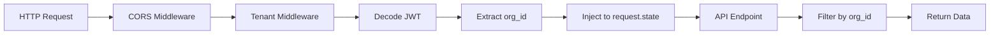

# 📊 דוח מפורט: ארכיטקטורת המערכת - Fleet Management System

## 🎯 מבט על

מערכת **Fleet Management** בנויה כמערכת **Multi-Tenant SaaS** מלאה עם הפרדה מוחלטת בין ארגונים. המערכת מאפשרת לכמה עשרות/מאות חברות הובלות עצמאיות לנהל את הצי שלהן באותה תשתית טכנולוגית.

---

## 🏗️ ארכיטקטורת Multi-Tenant

### 📂 הפרדת נתונים

המערכת מבטיחה הפרדה מוחלטת בין ארגונים בכמה רמות:

#### 1. רמת מסד הנתונים
```sql
-- כל טבלת עסק מכילה org_id
CREATE TABLE customers (
    id SERIAL PRIMARY KEY,
    org_id UUID NOT NULL REFERENCES organizations(id) ON DELETE CASCADE,
    name VARCHAR(255) NOT NULL,
    ...
    INDEX(org_id)  -- אינדקס לביצועים
);

-- 20 טבלאות עם org_id מופרדות:
organizations, users, customers, sites, drivers, trucks, 
jobs, materials, price_lists, statements, payments, expenses...
```

#### 2. רמת Middleware (אבטחה אוטומטית)
```python
# backend/app/middleware/tenant.py
async def tenant_middleware(request: Request, call_next):
    """מחלץ org_id מ-JWT ומכניס לכל request"""
    
    # מחלץ token מ-Authorization header
    payload = jwt.decode(token, SECRET_KEY)
    org_id = payload.get("org_id")
    
    # מכניס לכל request
    request.state.org_id = org_id
    request.state.is_super_admin = payload.get("is_super_admin")
    
    # Super Admin יכול לחקות ארגונים דרך X-Org-Id header
    if is_super_admin and request.headers.get("X-Org-Id"):
        request.state.org_id = request.headers["X-Org-Id"]
```

#### 3. רמת API Endpoints
```python
# כל endpoint מסנן אוטומטית לפי org_id
@router.get("/customers")
def list_customers(request: Request, db: Session):
    org_id = get_current_org_id(request)  # מ-middleware
    customers = db.query(Customer).filter(Customer.org_id == org_id).all()
    return customers
```

---

## 👑 מערכת Super Admin

### 🎛️ מה זה Super Admin?

**Super Admin** הוא מנהל מערכת שיכול לנהל את **כל הארגונים** במערכת. זה לא חלק מאף ארגון ספציפי, אלא ברמת המערכת כולה.

### ✨ יכולות Super Admin

```typescript
// Frontend: /super-admin/page.tsx
// דף נפרד לחלוטין מממשק הרגיל

1. 📊 ניהול ארגונים:
   - רשימת כל הארגונים
   - יצירת ארגון חדש
   - השעיה/הפעלה של ארגון
   - עריכת הגבלות (כמות משאיות/נהגים)
   
2. 🔐 הרשאות מיוחדות:
   - איפוס סיסמה לכל משתמש
   - התחברות כמנהל ארגון (Impersonation)
   - מחיקת ארגון (עם כל הנתונים)
   
3. 📈 דשבורד מערכתי:
   - סך הארגונים הפעילים
   - סטטיסטיקות שימוש
   - הכנסות חודשיות (MRR)
```

### 🔄 Impersonation (חיקוי ארגון)

```typescript
// כך Super Admin נכנס לאירגון ספציפי:
localStorage.setItem('impersonated_org_id', org_id)

// כל API call יכלול:
headers: {
  'X-Org-Id': localStorage.getItem('impersonated_org_id'),
  'Authorization': 'Bearer super_admin_token'
}

// Middleware יזהה ויעבור לארגון הרצוי
```

---

## 🚫 הפרדה מוחלטת: Super Admin ≠ ארגונים

### 📍 הפרדה פיזית

| **היבט** | **Super Admin** | **ארגון רגיל** |
|-----------|----------------|----------------|
| **URL** | `/super-admin/*` | `/dashboard`, `/jobs`, `/customers` |
| **API** | `/api/super-admin/*` | `/api/customers`, `/api/jobs` |
| **נתונים** | רואה כל הארגונים | רק org_id שלו |
| **Middleware** | `require_super_admin()` | `get_current_org_id()` |
| **Frontend** | דף נפרד לחלוטין | ממשק עסק רגיל |

### 🔒 אבטחה

```python
# Super Admin endpoints דורשים אישור מיוחד
@router.get("/super-admin/organizations")
def list_organizations(request: Request):
    require_super_admin(request)  # זורק 403 אם לא Super Admin
    return db.query(Organization).all()

# Endpoints רגילים מוגבלים לארגון
@router.get("/customers") 
def list_customers(request: Request):
    org_id = get_current_org_id(request)  # רק הארגון שלי
    return db.query(Customer).filter(Customer.org_id == org_id).all()
```

---

## 📱 מערכת המשתמשים והאימות

### 👥 סוגי משתמשים

```python
# כל משתמש שייך לארגון אחד בלבד
class User:
    id: int
    org_id: UUID          # הארגון שלו
    name: str
    email: Optional[str]  # אופציונלי (נהגים בלי אימייל)  
    phone: Optional[str]  # חובה לנהגים
    is_super_admin: bool  # רק למנהל מערכת
    org_role: str         # תפקיד בארגון
```

### 🔐 3 שיטות התחברות

#### 1️⃣ אימייל + סיסמה (מנהלים)
```python
POST /api/auth/login
{
  "email": "admin@company.com",
  "password": "secure123"
}
```

#### 2️⃣ טלפון + OTP (נהגים - ייצור)
```python
# שלב 1: בקשת קוד
POST /api/phone-auth/send-otp
{
  "phone": "0507771111",
  "org_slug": "default-org"
}

# שלב 2: אימות קוד  
POST /api/phone-auth/verify-otp
{
  "phone": "0507771111", 
  "otp_code": "123456",
  "org_slug": "default-org"
}
```

#### 3️⃣ טלפון + סיסמה (פיתוח)
```python
POST /api/phone-auth/login-with-password
{
  "phone": "0507771111",
  "password": "demo123",
  "org_slug": "default-org"
}
```

### 📋 מערכת הרשאות

```python
# כל משתמש יכול לקבל הרשאות ספציפיות
class UserPermission:
    user_id: int
    permission_name: str     # 'jobs.create', 'customers.edit'
    granted: bool
    expires_at: Optional[datetime]

# הרשאות זמינות:
PERMISSIONS = {
    'dashboard.view': 'צפייה בדשבורד',
    'jobs.create': 'יצירת נסיעות',
    'jobs.assign': 'שיבוץ נהגים',
    'customers.edit': 'עריכת לקוחות',
    'statements.create': 'יצירת חשבוניות',
    'mobile.signature': 'חתימה במובייל',
    ...
}
```

### 🔄 JWT Token Structure

```json
{
  "sub": "123",              // user_id
  "email": "user@org.com",
  "org_id": "uuid-here",     // החלק הקריטי!
  "is_super_admin": false,
  "org_role": "dispatcher",
  "exp": 1640995200
}
```

---

## 🔍 איך עובד ה-Tenant Middleware?

### 🛠️ התהליך השלם



### 📝 הקוד בפועל

```python
# 1. כל request עובר דרך middleware
@app.middleware("http")
async def tenant_middleware(request: Request, call_next):
    
    # 2. מדלג על endpoints ציבוריים
    if request.url.path in ["/health", "/api/auth/login"]:
        return await call_next(request)
    
    # 3. מחלץ token
    token = request.headers.get("Authorization").replace("Bearer ", "")
    
    # 4. פוענח JWT
    payload = jwt.decode(token, SECRET_KEY)
    
    # 5. מכניס org_id ל-request
    request.state.org_id = payload["org_id"]
    request.state.is_super_admin = payload["is_super_admin"]
    
    # 6. ממשיך ל-endpoint
    return await call_next(request)

# 7. Endpoint מקבל org_id אוטומטית
@router.get("/customers")
def list_customers(request: Request, db: Session):
    org_id = request.state.org_id  # זמין אוטומטית!
    return db.query(Customer).filter(Customer.org_id == org_id).all()
```

---

## 🚨 בעיות עיקריות ומגבלות נוכחיות

### 1. 🔄 OTP לא עובד (SMS לא מוטמע)

```python
# בקובץ permission_service.py שורה 283:
# TODO: Send SMS here (integration with SMS provider)
logger.info(f"Generated OTP {otp_code} for phone {phone}")
print(f"🔐 OTP for {phone}: {otp_code} (expires in 5 minutes)")

# הקוד רק מדפיס לקונסול - לא שולח SMS אמיתי!
```

**פתרונות אפשריים:**
- אינטגרציה עם Twilio SMS API
- SMS ישראלי (Inforu, SMS4FREE)  
- בינתיים: שימוש במצב פיתוח (טלפון + סיסמה)

### 2. 🎨 Super Admin לא מופרד ויזואלית

```tsx
// כרגע Super Admin נמצא באותו layout של הארגון
<DashboardLayout>  {/* ❌ לא נכון - זה layout של ארגון */}
  <SuperAdminPage />
</DashboardLayout>

// צריך layout נפרד:
<SuperAdminLayout>  {/* ✅ כך צריך */}
  <SuperAdminPage />
</SuperAdminLayout>
```

### 3. 📞 מערכת טלפונים מבולבלת

```typescript
// בעיה: מערכת מחפשת נהגים לפי טלפון
// אבל משתמש יכול להיות גם מנהל עם טלפון

// בAPIכ:
const user = PermissionService.find_user_by_phone(phone, org_id)

// הבעיה: אם יש מנהל וגם נהג עם אותו טלפון?
// המערכת לא יודעת למי להתחבר
```

### 4. 🔐 הרשאות מסובכות מדי

```python
# יש 3 שכבות הרשאות מבולבלות:
1. org_role: 'owner', 'admin', 'dispatcher', 'driver'  # בטבלת users
2. UserPermission: רשימת הרשאות ספציפיות         # בטבלת user_permissions  
3. is_super_admin: True/False                        # בטבלת users

# זה מסובך מדי למערכת קטנה!
```

---

## 💡 הצעות לשיפור

### 🏗️ הצעה 1: הפרדה מוחלטת של Super Admin

```bash
# מבנה תיקיות מוצע:
frontend/
├── src/app/
│   ├── (tenant)/          # כל מה שקשור לארגון
│   │   ├── dashboard/
│   │   ├── jobs/
│   │   └── customers/
│   └── super-admin/       # ממשק נפרד לחלוטין
│       ├── layout.tsx     # Layout משלו
│       ├── page.tsx       # דשבורד מערכתי
│       └── organizations/ # ניהול ארגונים

backend/
├── app/api/v1/endpoints/
│   ├── tenant/            # endpoints לארגונים
│   │   ├── jobs.py
│   │   └── customers.py  
│   └── system/           # endpoints מערכתיים
│       ├── super_admin.py
│       └── organizations.py
```

### 🎨 הצעה 2: ממשק Super Admin נפרד

```typescript
// SuperAdminLayout.tsx - layout מיוחד
export default function SuperAdminLayout({ children }: { children: React.ReactNode }) {
  return (
    <div className="bg-gray-900 min-h-screen"> {/* עיצוב שחור/אפור */}
      <SuperAdminSidebar />
      <main className="ml-64">
        <SuperAdminHeader />
        {children}
      </main>
    </div>
  )
}

// TenantLayout.tsx - layout לארגונים
export default function TenantLayout({ children }: { children: React.ReactNode }) {
  return (
    <div className="bg-white min-h-screen"> {/* עיצוב לבן/כחול */}
      <TenantSidebar />
      <main className="ml-64">
        <TenantHeader />
        {children}
      </main>
    </div>
  )
}
```

### 📱 הצעה 3: פישוט מערכת המשתמשים

```python
# במקום 3 שכבות הרשאות, פישוט:

class User:
    # הרשאה יחידה וברורה
    system_role: str  # 'SUPER_ADMIN' | 'TENANT_USER'
    tenant_role: str  # 'OWNER' | 'ADMIN' | 'DISPATCHER' | 'DRIVER'
    
    # טלפון אופציונלי לכולם
    email: str        # חובה לכולם
    phone: Optional[str]  # אופציונלי
    
    # הרשאות פשוטות
    can_login_with_phone: bool = False  # רק לנהגים
```

### 🔐 הצעה 4: מערכת אימות מאוחדת

```typescript
// במקום 3 API endpoints שונים:
// /api/auth/login (אימייל)
// /api/phone-auth/send-otp (טלפון + OTP)  
// /api/phone-auth/login-with-password (טלפון + סיסמה)

// מערכת אחת:
POST /api/auth/login
{
  "credential": "admin@company.com" | "0507771111",
  "password": "secure123",
  "otp_code": "123456",    // אופציונלי
  "org_slug": "my-company" // אופציונלי
}
```

### 🏢 הצעה 5: דף ניהול טנטים מאוחד

```tsx
// /super-admin/tenants/page.tsx
export default function TenantsManagement() {
  return (
    <SuperAdminLayout>
      {/* כרטיסיות */}
      <Tabs defaultValue="organizations">
        <TabsList>
          <TabsTrigger value="organizations">ארגונים</TabsTrigger>
          <TabsTrigger value="create">יצירת ארגון</TabsTrigger>
          <TabsTrigger value="settings">הגדרות מערכת</TabsTrigger>
        </TabsList>

        {/* רשימת ארגונים + פילטרים */}
        <TabsContent value="organizations">
          <OrganizationsList />
        </TabsContent>

        {/* יצירת ארגון חדש */}
        <TabsContent value="create">
          <CreateOrganizationWizard />
        </TabsContent>
      </Tabs>
    </SuperAdminLayout>
  )
}
```

---

## 🎯 מסקנות והמלצות

### ✅ מה עובד טוב

1. **הפרדת נתונים מושלמת** - מסד נתונים מאובטח לחלוטין
2. **Middleware חכם** - הפרדה אוטומטית בכל API call
3. **Super Admin מלא** - יכולת ניהול מלאה של המערכת
4. **Multi-tenant מוכן** - אפשר להוסיף עשרות ארגונים

### ❌ מה צריך שיפור

1. **OTP לא עובד** - צריך אינטגרציה עם SMS
2. **UI מבולבל** - Super Admin מעורב עם ממשק הארגון
3. **הרשאות מסובכות** - 3 שכבות זה יותר מדי  
4. **מערכת טלפונים** - צריך לחשב מחדש מי מתחבר איך

### 🚀 סדר עדיפויות לפיתוח

1. **גבוה**: הפרדה ויזואלית של Super Admin
2. **בינוני**: פישוט מערכת הרשאות
3. **נמוך**: אינטגרציה עם SMS לOTP
4. **עתיד**: Self-service signup לארגונים חדשים

---

## 📊 סיכום טכני

**המערכת מוכנה לייצור?** 🟡 **כמעט**

- ✅ אבטחה וhững נתונים מושלמים
- ✅ Super Admin פונקציונלי
- ⚠️ צריך עבודה על UX/UI
- ❌ OTP לא עובד (בלוק לנהגים)

**זמן משוער לשיפורים:** 2-3 ימי פיתוח
**עלות SMS:** ~₪100/חודש לארגון ממוצע
