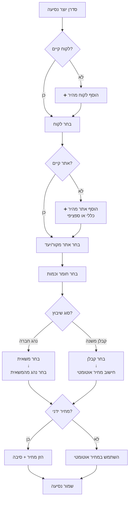

# איפיון מערכת קבלני משנה ושיפורים - Fleet Management System

**תאריך**: 26 ינואר 2026  
**גרסה**: 2.0  
**סטטוס**: בפיתוח

---

## 📋 תוכן עניינים

1. [מצב נוכחי - מה שנבנה](#מצב-נוכחי---מה-שנבנה)
2. [שינויים ארכיטקטוניים נדרשים](#שינויים-ארכיטקטוניים-נדרשים)
3. [תכונות חדשות לפיתוח](#תכונות-חדשות-לפיתוח)
4. [מערך דוחות מורחב](#מערך-דוחות-מורחב)
5. [מודל נתונים מעודכן](#מודל-נתונים-מעודכן)
6. [תהליכי עבודה (Workflows)](#תהליכי-עבודה-workflows)

---

## מצב נוכחי - מה שנבנה

### ✅ מערכת קבלני משנה - Phase 1 (הושלם)

#### 1. מודל Subcontractor
```python
class Subcontractor:
    id: int
    org_id: UUID
    name: str                           # שם קבלן
    company_name: str                   # שם חברה
    vat_id: str                         # ח.פ
    contact_person: str                 # איש קשר
    phone: str                          # טלפון (חובה)
    email: str                          # דוא"ל
    address: str                        # כתובת
    truck_plate_number: str             # ⭐ NEW - מספר משאית ייחודי לקבלן
    payment_terms: str                  # תנאי תשלום (monthly/weekly)
    payment_method: str                 # אמצעי תשלום
    bank_details: str                   # פרטי בנק
    notes: str                          # הערות
    is_active: bool                     # פעיל/לא פעיל
    created_at: datetime
    updated_at: datetime
```

**תכונות:**
- ✅ CRUD מלא (יצירה, עריכה, מחיקה, צפייה)
- ✅ חיפוש לפי שם/חברה/ח.פ
- ✅ סינון לפי סטטוס פעיל
- ✅ Multi-tenant (org_id isolation)
- ✅ מספר משאית ייחודי לקבלן (truck_plate_number) - לדוחות

#### 2. מחירון קבלן משנה (SubcontractorPriceList)
```python
class SubcontractorPriceList:
    id: int
    org_id: UUID
    subcontractor_id: int               # קישור לקבלן
    truck_id: int                       # משאית ספציפית (אופציונלי)
    customer_id: int                    # לקוח ספציפי (אופציונלי)
    material_id: int                    # חומר ספציפי (אופציונלי)
    from_site_id: int                   # אתר מקור (אופציונלי)
    to_site_id: int                     # אתר יעד (אופציונלי)
    
    # מחירים
    price_per_trip: Decimal             # מחיר לנסיעה
    price_per_ton: Decimal              # מחיר לטון
    price_per_m3: Decimal               # מחיר למ"ק
    price_per_km: Decimal               # מחיר לק"מ
    min_charge: Decimal                 # חיוב מינימום
    
    # תוקף
    valid_from: datetime
    valid_to: datetime
    is_active: bool
    notes: str
```

**לוגיקת חישוב מחיר:**
```python
# אם יש מחיר לנסיעה
base_price = price_per_trip

# אם יש מחיר לפי כמות (טון/מ"ק)
if price_per_ton:
    base_price += (quantity * price_per_ton)

# בדיקת מינימום
final_price = max(base_price, min_charge)
```

#### 3. שילוב במערכת נסיעות (Jobs)
```python
class Job:
    # ... existing fields ...
    
    # Assignment Type
    driver_id: int                      # נהג חברה (אופציונלי)
    truck_id: int                       # משאית חברה (אופציונלי)
    
    # Subcontractor Assignment
    is_subcontractor: bool              # האם זה קבלן משנה?
    subcontractor_id: int               # קישור לקבלן משנה
    subcontractor_price_total: Decimal  # מחיר סופי לקבלן
    subcontractor_price_breakdown_json: JSON  # פירוט חישוב
```

**תהליך עבודה בטופס יצירת נסיעה:**
1. בחירת סוג שיבוץ: "נהג חברה" / "קבלן משנה"
2. אם נבחר נהג חברה → בחירת נהג + משאית
3. אם נבחר קבלן משנה:
   - בחירת קבלן מרשימה
   - חישוב אוטומטי של מחיר מהמחירון
   - הצגת תצוגה מקדימה של המחיר
4. שמירת הנסיעה עם הנתונים המתאימים

#### 4. API Endpoints (מומש)
```
GET    /api/subcontractors                    # רשימה + חיפוש
GET    /api/subcontractors/{id}               # פרטי קבלן
POST   /api/subcontractors                    # יצירת קבלן
PATCH  /api/subcontractors/{id}               # עדכון קבלן
DELETE /api/subcontractors/{id}               # מחיקת קבלן

GET    /api/subcontractors/{id}/prices        # מחירוני קבלן
POST   /api/subcontractors/{id}/prices        # יצירת מחירון
PATCH  /api/subcontractors/{id}/prices/{pid}  # עדכון מחירון
DELETE /api/subcontractors/{id}/prices/{pid}  # מחיקת מחירון

GET    /api/subcontractors/{id}/pricing-preview?qty=10&unit=TON  # תצוגה מקדימה
GET    /api/subcontractors/{id}/summary?from_date=X&to_date=Y    # סיכום עבודה
```

---

## שינויים ארכיטקטוניים נדרשים

### 🔄 שינוי 1: המערכת תהיה תלויה במשאית ולא בנהג

#### מצב נוכחי (Driver-Centric):
```python
Job:
    driver_id → Driver → default_truck_id
```
הנהג הוא הישות המרכזית, והמשאית נקבעת לפי ברירת המחדל של הנהג.

#### מצב רצוי (Truck-Centric):
```python
Job:
    truck_id → Truck → assigned_driver_id (or multiple drivers)
```
המשאית היא הישות המרכזית, והנהגים משויכים למשאית.

#### שינויים נדרשים במודל:

**1. עדכון מודל Truck:**
```python
class Truck:
    id: int
    org_id: UUID
    plate_number: str                   # מספר רישוי (ייחודי!)
    model: str
    truck_type: str                     # פול טריילר/סמי/דאבל
    capacity_ton: Decimal
    capacity_m3: Decimal
    
    # Driver Assignment (NEW)
    primary_driver_id: int              # נהג ראשי
    secondary_driver_ids: List[int]     # נהגים משניים (JSON array)
    
    owner_type: str                     # COMPANY / SUBCONTRACTOR
    subcontractor_id: int               # אם שייך לקבלן
    
    is_active: bool
    created_at: datetime
```

**2. עדכון מודל Driver:**
```python
class Driver:
    id: int
    org_id: UUID
    user_id: int                        # קישור למשתמש מערכת
    name: str
    phone: str
    license_type: str
    license_expiry: datetime
    
    # REMOVED: default_truck_id (לא צריך יותר!)
    
    is_active: bool
    created_at: datetime
    
    # Relationship (NEW)
    assigned_trucks: List[Truck]        # משאיות שהנהג משויך אליהן
```

**3. עדכון מודל Job:**
```python
class Job:
    # ... existing fields ...
    
    # Primary Assignment (CHANGED)
    truck_id: int                       # חובה! המשאית היא הבסיס
    driver_id: int                      # אופציונלי - ברירת מחדל מהמשאית
    
    # Subcontractor (unchanged)
    is_subcontractor: bool
    subcontractor_id: int
```

#### Migration Plan:
1. הוסף `primary_driver_id` ו-`secondary_driver_ids` ל-Truck
2. מלא נתונים קיימים: `Truck.primary_driver_id = Driver.default_truck_id` (reverse lookup)
3. הסר `Driver.default_truck_id`
4. עדכן לוגיקה ב-Job creation - תחילה בחירת משאית, אחר כך נהג (רשימה מסוננת)
5. עדכן UI - Dispatch Board לפי משאיות

---

## תכונות חדשות לפיתוח

### ✨ תכונה 1: מחיר ידני כללי לתעודה (Manual Price Override)

**מצב נוכחי:**
- Job.pricing_total - מחיר ללקוח (חושב אוטומטית)
- Job.manual_override_total + manual_override_reason - Override קיים אבל לא בשימוש מלא

**שיפור נדרש:**
הוסף שדה במסך עריכת Job:

```typescript
// Job Form - Pricing Section
<div className="bg-yellow-50 border border-yellow-300 rounded-lg p-4">
  <label className="flex items-center gap-2 mb-2">
    <input
      type="checkbox"
      checked={manualPricingEnabled}
      onChange={(e) => setManualPricingEnabled(e.target.checked)}
    />
    <span className="font-medium">🖊️ מחיר ידני (Override)</span>
  </label>
  
  {manualPricingEnabled && (
    <>
      <input
        type="number"
        step="0.01"
        value={manualPrice}
        onChange={(e) => setManualPrice(e.target.value)}
        placeholder="הכנס מחיר ידני"
        className="w-full px-3 py-2 border rounded mb-2"
      />
      <textarea
        value={overrideReason}
        onChange={(e) => setOverrideReason(e.target.value)}
        placeholder="סיבה לשינוי מחיר (חובה)"
        required
        className="w-full px-3 py-2 border rounded"
        rows={2}
      />
    </>
  )}
</div>
```

**Backend Validation:**
```python
@router.patch("/jobs/{id}")
def update_job(id: int, data: JobUpdate, current_user: User = ...):
    if data.manual_override_total is not None:
        if not data.manual_override_reason:
            raise HTTPException(400, "Must provide reason for manual price override")
        
        # Audit log
        create_audit_log(
            entity_type="Job",
            entity_id=id,
            action="PRICE_OVERRIDE",
            user_id=current_user.id,
            before=job.pricing_total,
            after=data.manual_override_total,
            reason=data.manual_override_reason
        )
```

**הרשאות:**
- רק ADMIN / ACCOUNTING יכולים לשנות מחיר ידנית
- Dispatcher לא יכול (או רק עם אישור)

---

### ✨ תכונה 2: הוספת אתר מתוך תעודה (Quick Add from Job Form)

**Use Case:**
נהג בשטח או סדרן יוצר נסיעה ולא מוצא את האתר ברשימה → צריך להוסיף אותו מהר בלי לצאת מהטופס.

**UI Design:**

```tsx
// In Job Form - Site Selection
<Combobox
  label="לאתר"
  options={availableSites}
  value={formData.to_site_id}
  onChange={...}
  actions={[
    {
      label: "➕ אתר חדש",
      onClick: () => setShowQuickAddSite(true)
    }
  ]}
/>

{showQuickAddSite && (
  <Modal title="הוספת אתר מהירה">
    <QuickAddSiteForm
      customerId={formData.customer_id}  // מועבר אוטומטית
      onSuccess={(newSite) => {
        // Add to list
        setSites(prev => [...prev, newSite])
        // Select it
        setFormData(prev => ({ ...prev, to_site_id: newSite.id }))
        // Close modal
        setShowQuickAddSite(false)
      }}
      onCancel={() => setShowQuickAddSite(false)}
    />
  </Modal>
)}
```

**QuickAddSiteForm Component:**
```tsx
interface QuickAddSiteFormProps {
  customerId?: number  // אם יש לקוח נבחר
  onSuccess: (site: Site) => void
  onCancel: () => void
}

function QuickAddSiteForm({ customerId, onSuccess, onCancel }: Props) {
  const [formData, setFormData] = useState({
    name: '',
    address: '',
    customer_id: customerId || null,
    site_type: customerId ? 'customer_project' : 'general',
    is_generic: !customerId,  // אתר כללי אם אין לקוח
    contact_name: '',
    contact_phone: ''
  })
  
  return (
    <form onSubmit={handleSubmit}>
      {/* שדות מינימליים */}
      <input name="name" required placeholder="שם האתר" />
      <input name="address" required placeholder="כתובת" />
      
      {!customerId && (
        <label>
          <input
            type="checkbox"
            checked={formData.is_generic}
            onChange={(e) => setFormData({
              ...formData,
              is_generic: e.target.checked,
              site_type: e.target.checked ? 'general' : 'customer_project'
            })}
          />
          אתר כללי (לא משויך ללקוח ספציפי)
        </label>
      )}
      
      <button type="submit">💾 שמור והמשך</button>
      <button type="button" onClick={onCancel}>ביטול</button>
    </form>
  )
}
```

**Backend - Quick Create Endpoint:**
```python
@router.post("/sites/quick-add", response_model=SiteResponse)
def quick_add_site(
    data: SiteQuickCreate,
    current_user: User = Depends(get_current_user),
    db: Session = Depends(get_db)
):
    """
    Quick site creation with minimal fields
    Auto-assigns org_id from current user
    """
    site = Site(
        org_id=current_user.org_id,
        name=data.name,
        address=data.address,
        customer_id=data.customer_id,  # Can be None for generic
        site_type=data.site_type,
        is_generic=data.is_generic,
        created_by=current_user.id
    )
    db.add(site)
    db.commit()
    db.refresh(site)
    return site
```

---

### ✨ תכונה 3: הוספת לקוח מהירה (Quick Add Customer)

**דומה לתכונה 2, אבל ללקוחות:**

```tsx
// In Job Form
<Combobox
  label="לקוח"
  options={customers}
  value={formData.customer_id}
  onChange={...}
  actions={[
    {
      label: "➕ לקוח חדש",
      onClick: () => setShowQuickAddCustomer(true)
    }
  ]}
/>

<QuickAddCustomerModal
  show={showQuickAddCustomer}
  onSuccess={(newCustomer) => {
    setCustomers(prev => [...prev, newCustomer])
    setFormData(prev => ({ ...prev, customer_id: newCustomer.id }))
    setShowQuickAddCustomer(false)
  }}
  onCancel={() => setShowQuickAddCustomer(false)}
/>
```

**שדות מינימליים בטופס מהיר:**
- שם לקוח (חובה)
- טלפון (חובה)
- ח.פ (אופציונלי)
- איש קשר (אופציונלי)

---

### ✨ תכונה 4: אתרים כלליים (ללא תלות בלקוח)

**מצב נוכחי:**
```python
Site.customer_id: int  # חובה - אתר תמיד משויך ללקוח
```

**שינוי נדרש:**
```python
Site.customer_id: int | None  # אופציונלי!
Site.is_generic: bool = False  # אתר כללי?
```

**סוגי אתרים:**
1. **Customer Project Site** - אתר של לקוח ספציפי (פרויקט בנייה)
2. **Generic Site** - אתר כללי:
   - מחצבות (אספקת חומרים)
   - תחנות דלק
   - מזבלות
   - תחנות מעבר

**UI Indicator:**
```tsx
{sites.map(site => (
  <option key={site.id} value={site.id}>
    {site.is_generic && '🏭 '}  {/* אייקון לאתר כללי */}
    {site.name}
    {site.customer_id && ` - ${site.customer.name}`}
  </option>
))}
```

**Validation Rule:**
```python
# אתר כללי לא יכול להיות משויך ללקוח
if site.is_generic and site.customer_id:
    raise ValidationError("Generic site cannot have customer_id")
```

---

## מערך דוחות מורחב

### 📊 דוח 1: דוחות קבלן משנה (Subcontractor Report)

**מטרה:** לראות את כל הנסיעות והעלויות של קבלן משנה בתקופה נתונה.

**Endpoint:**
```python
GET /api/reports/subcontractors/{id}/jobs?from_date=2026-01-01&to_date=2026-01-31
```

**Response:**
```json
{
  "subcontractor": {
    "id": 5,
    "name": "קבלן משה כהן",
    "truck_plate_number": "12-345-67"
  },
  "period": {
    "from": "2026-01-01",
    "to": "2026-01-31"
  },
  "summary": {
    "total_jobs": 45,
    "total_trips": 45,
    "total_tons": 890.5,
    "total_cost": 67500.00,
    "avg_cost_per_trip": 1500.00,
    "avg_cost_per_ton": 75.80
  },
  "jobs": [
    {
      "job_id": 123,
      "date": "2026-01-15",
      "customer": "חברת ABC",
      "from_site": "מחצבה נחל שורק",
      "to_site": "פרויקט רמת גן",
      "material": "חצץ מצע 0-4",
      "quantity": 20.0,
      "unit": "TON",
      "cost": 1600.00,
      "breakdown": {
        "price_per_trip": 500,
        "price_per_ton": 55,
        "calculation": "500 + (20 * 55) = 1600"
      }
    }
  ]
}
```

**UI - דוח קבלן:**
```tsx
<SubcontractorReport subcontractorId={id}>
  {/* סינון תאריכים */}
  <DateRangeFilter from={fromDate} to={toDate} />
  
  {/* סיכום */}
  <SummaryCards>
    <Card title="סה״כ נסיעות" value={summary.total_jobs} />
    <Card title="סה״כ טונות" value={summary.total_tons} />
    <Card title="סה״כ עלות" value={`₪${summary.total_cost}`} />
    <Card title="ממוצע לנסיעה" value={`₪${summary.avg_cost_per_trip}`} />
  </SummaryCards>
  
  {/* טבלת נסיעות */}
  <JobsTable jobs={jobs} showCost={true} />
  
  {/* כפתורי ייצוא */}
  <ExportButtons>
    <button onClick={exportPDF}>📄 PDF</button>
    <button onClick={exportExcel}>📊 Excel</button>
  </ExportButtons>
</SubcontractorReport>
```

---

### 📊 דוח 2: דוחות לפי משאית (Truck Report)

**מטרה:** מעקב אחר משאית ספציפית - כולל נסיעות, נהגים, הכנסות/הוצאות.

**Types:**
1. **Company Truck Report** - משאית של החברה
2. **Subcontractor Truck Report** - משאית של קבלן (לפי truck_plate_number)

**Endpoint:**
```python
GET /api/reports/trucks/{id}?from_date=X&to_date=Y&include_expenses=true
```

**Response Structure:**
```json
{
  "truck": {
    "id": 3,
    "plate_number": "12-345-67",
    "model": "מרצדס אקטרוס",
    "owner_type": "SUBCONTRACTOR",
    "subcontractor": {
      "id": 5,
      "name": "קבלן משה כהן"
    }
  },
  "summary": {
    "total_jobs": 85,
    "total_km": 4500,
    "total_revenue": 127000.00,     // הכנסות מלקוחות
    "total_subcontractor_cost": 67500.00,  // עלות קבלן (אם קבלן משנה)
    "total_expenses": 12000.00,     // דלק, תיקונים וכו׳
    "net_profit": 47500.00,         // revenue - subcontractor_cost - expenses
    "utilization_rate": 0.85        // % ימי עבודה מתוך התקופה
  },
  "jobs": [...],
  "expenses": [...]
}
```

**UI Features:**
- תרשים עמודות: הכנסות לעומת הוצאות לפי חודש
- תרשים קו: ניצולת משאית לאורך זמן
- פילוח הוצאות: דלק vs תיקונים vs אחר
- השוואה בין משאיות

---

### 📊 דוח 3: דוחות לפי לקוח (Customer Report)

**מטרה:** ניתוח עבודה מול לקוח - נסיעות, הכנסות, יתרות.

**Endpoint:**
```python
GET /api/reports/customers/{id}?from_date=X&to_date=Y
```

**Response:**
```json
{
  "customer": {
    "id": 10,
    "name": "חברת ABC בע״מ",
    "payment_terms": "Net 30"
  },
  "summary": {
    "total_jobs": 120,
    "total_revenue": 450000.00,
    "total_paid": 380000.00,
    "outstanding_balance": 70000.00,
    "oldest_unpaid_invoice_date": "2025-12-15",
    "payment_health_score": 85  // 0-100 based on payment history
  },
  "breakdown_by_material": [
    {
      "material": "חצץ מצע",
      "jobs": 80,
      "total_tons": 1600,
      "revenue": 320000
    },
    {
      "material": "עפר",
      "jobs": 40,
      "total_m3": 800,
      "revenue": 130000
    }
  ],
  "jobs": [...],
  "statements": [...],  // חשבוניות
  "payments": [...]     // תשלומים
}
```

**UI Sections:**
1. **סיכום כללי** - Cards עם KPIs
2. **תרשים גבייה** - Payment timeline
3. **פילוח לפי חומר** - Pie chart
4. **טבלת נסיעות** - עם סטטוסים
5. **היסטוריית חשבוניות ותשלומים**
6. **התראות** - חשבוניות שעברו מועד, חובות

---

## מודל נתונים מעודכן

### ERD Diagram (Updated)

```
┌─────────────────┐
│  Organization   │
└────────┬────────┘
         │
    ┌────┴──────────────────────────────────┐
    │                                       │
┌───▼───────┐                      ┌────────▼────────┐
│   User    │                      │   Customer      │
└───┬───────┘                      └────────┬────────┘
    │                                       │
    │                              ┌────────▼────────┐
    │                              │     Site        │
    │                              │  is_generic?    │
    │                              └────────┬────────┘
    │                                       │
┌───▼───────────┐                          │
│    Driver     │                          │
│ (no default_  │                          │
│   truck!)     │                          │
└───┬───────────┘                          │
    │                                      │
    │   assigned_to               ┌────────▼────────┐
    │   ┌─────────────────────────▶     Job        │
    │   │                         │ truck_id (PK)  │
┌───▼───▼───────────┐             │ driver_id      │
│      Truck        │◄────────────┤ subcontractor? │
│  primary_driver   │             └────────┬────────┘
│  secondary_drivers│                      │
│  owner_type       │                      │
│  subcontractor_id?│                      │
└───────┬───────────┘                      │
        │                                  │
        │ owns                    ┌────────▼──────────┐
┌───────▼────────────┐            │  DeliveryNote     │
│  Subcontractor     │            │  Signature        │
│  truck_plate_number│            └───────────────────┘
└───────┬────────────┘
        │
        │ has
┌───────▼───────────────────┐
│ SubcontractorPriceList    │
│  price_per_trip          │
│  price_per_ton           │
│  min_charge              │
│  truck_id? (specific)    │
└───────────────────────────┘
```

---

## תהליכי עבודה (Workflows)

### Workflow 1: יצירת נסיעה עם קבלן משנה (Updated)



### Workflow 2: שיבוץ נהג למשאית (New)

```
1. Admin/Dispatcher נכנס לניהול צי
2. בוחר משאית
3. מסך עריכת משאית:
   - Primary Driver: dropdown של נהגים פעילים
   - Secondary Drivers: multi-select
4. שומר
5. במסך נסיעה חדשה:
   - בוחר משאית → רשימת נהגים מסוננת רק למשאית זו
   - ברירת מחדל: Primary Driver
```

### Workflow 3: יצירת מחירון קבלן

```
1. נכנסים לדף קבלן משנה
2. לוחצים על "💰 מחירונים"
3. "➕ מחירון חדש":
   
   Form Fields:
   - תוקף: מתאריך → עד תאריך
   - משאית ספציפית? (אופציונלי)
   - לקוח ספציפי? (אופציונלי)
   - חומר ספציפי? (אופציונלי)
   - מסלול: From Site → To Site (אופציונלי)
   
   מחירים:
   - ☑️ מחיר לנסיעה: ₪____
   - ☑️ מחיר לטון: ₪____
   - ☐ מחיר למ"ק: ₪____
   - ☐ מחיר לק"מ: ₪____
   - חיוב מינימום: ₪____
   
4. שמירה
5. מחירון מופיע ברשימה
6. בנסיעה חדשה - מחיר מחושב לפי המחירון המתאים ביותר
```

---

## תעדוף פיתוח (Priority)

### 🔴 Priority 1 (Critical - Week 1)
1. ✅ שדה truck_plate_number לקבלן (הושלם!)
2. ⏳ שינוי ארכיטקטורה: Truck-Centric (primary_driver_id)
3. ⏳ UI: בטופס Job - בחירת משאית לפני נהג
4. ⏳ מחיר ידני (Manual Override) עם אישור

### 🟡 Priority 2 (High - Week 2)
5. ⏳ Quick Add Site (מתוך טופס Job)
6. ⏳ Quick Add Customer (מתוך טופס Job)
7. ⏳ אתרים כלליים (is_generic flag)
8. ⏳ דוח קבלן משנה בסיסי

### 🟢 Priority 3 (Medium - Week 3-4)
9. ⏳ דוח משאית (Truck Report) עם רווחיות
10. ⏳ דוח לקוח מורחב (Customer Report)
11. ⏳ תרשימים ווויזואליזציה בדוחות
12. ⏳ ייצוא דוחות ל-PDF/Excel

---

## סיכום טכני

### Database Migrations Required:
```sql
-- 1. Add truck_plate_number to subcontractors (DONE ✅)
ALTER TABLE subcontractors ADD COLUMN truck_plate_number VARCHAR(20);
CREATE INDEX idx_subcontractors_truck_plate ON subcontractors(truck_plate_number);

-- 2. Add driver assignment to trucks
ALTER TABLE trucks ADD COLUMN primary_driver_id INTEGER REFERENCES drivers(id);
ALTER TABLE trucks ADD COLUMN secondary_driver_ids JSONB DEFAULT '[]';

-- 3. Remove default_truck_id from drivers
ALTER TABLE drivers DROP COLUMN default_truck_id;

-- 4. Make site.customer_id nullable
ALTER TABLE sites ALTER COLUMN customer_id DROP NOT NULL;
ALTER TABLE sites ADD COLUMN is_generic BOOLEAN DEFAULT FALSE;
```

### API Changes:
- ✅ `/api/subcontractors` - כבר קיים
- ⏳ `/api/reports/subcontractors/{id}/jobs` - חדש
- ⏳ `/api/reports/trucks/{id}` - חדש
- ⏳ `/api/reports/customers/{id}` - חדש
- ⏳ `/api/sites/quick-add` - חדש
- ⏳ `/api/customers/quick-add` - חדש

### UI Components:
- ✅ SubcontractorForm with truck_plate_number
- ✅ Job Form with driver/subcontractor selection
- ⏳ QuickAddSiteModal
- ⏳ QuickAddCustomerModal
- ⏳ ManualPriceOverrideSection
- ⏳ SubcontractorReportPage
- ⏳ TruckReportPage
- ⏳ CustomerReportPage

---

**Last Updated:** 26.01.2026  
**Author:** System Architect  
**Version:** 2.0 - Comprehensive Spec
